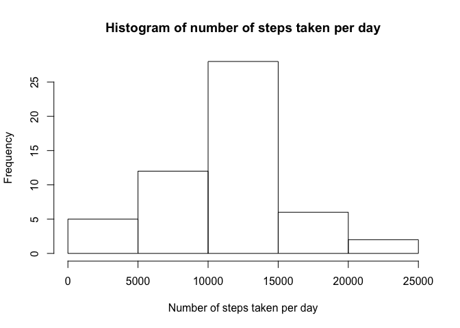
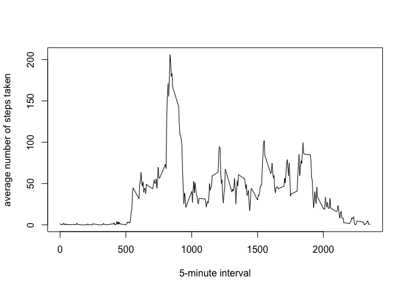
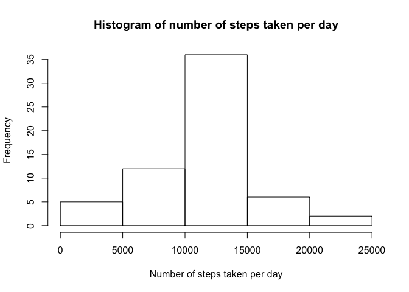
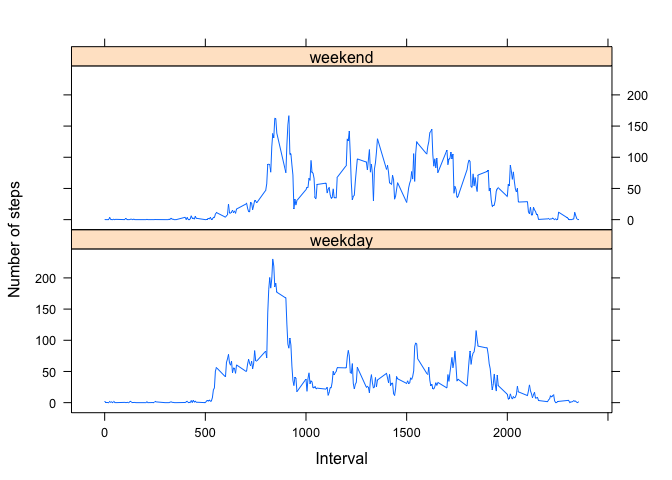

# Reproducible Research: Peer Assessment 1


## Loading and preprocessing the data
1. Load the data

```r
data <- read.csv("activity.csv", sep = ",")
```

## What is mean total number of steps taken per day?
1. Calculate the total number of steps takens per day

```r
stepsperday <- aggregate(data$steps, by=list(data$date), FUN=sum)
```

2. Make a histogram of the total number of steps taken each day

```r
hist(stepsperday$x, main="Histogram of number of steps taken per day", xlab="Number of steps taken per day")
```

 

3. Calcualte and report the mean and median of the total number of steps taken per day

```r
mean(stepsperday$x, na.rm=1)
```

```
## [1] 10766.19
```

```r
median(stepsperday$x, na.rm=1)
```

```
## [1] 10765
```

## What is the average daily activity pattern?
1. Make a time series plot of the 5-minute interval and the average number of steps taken, averaged across all days

```r
stepsperinterval <- aggregate(data$steps, by=list(data$interval), FUN=mean, na.rm=1)
plot(stepsperinterval$Group.1, stepsperinterval$x, "l", xlab="5-minute interval", ylab="average number of steps taken")
```

 

2. Which 5-minute interval, on average across all the days in the dataset, contains the maximum number of steps?

```r
stepsperinterval$Group.1[which.max(stepsperinterval$x)]
```

```
## [1] 835
```

## Imputing missing values
1. Calculate and report the total number of missing values in the dataset

```r
sum(is.na(data$steps))
```

```
## [1] 2304
```

2. Create a new dataset that is equal to the original dataset but with the missing data filled in

```r
for (i in 1:length(data$steps)){
  if (is.na(data$steps[i])){
    filledinvalue <- stepsperinterval$x[stepsperinterval$Group.1==data$interval[i]]
    data$steps[i] <- filledinvalue
  }
}
```

3. Make a histogram of the total number of steps taken each day

```r
stepsperday <- aggregate(data$steps, by=list(data$date), FUN=sum)
hist(stepsperday$x, main="Histogram of number of steps taken per day", xlab="Number of steps taken per day")
```

 

4. Calculate and report the mean and median total number of steps taken per day

```r
mean(stepsperday$x)
```

```
## [1] 10766.19
```

```r
median(stepsperday$x)
```

```
## [1] 10766.19
```

## Are there differences in activity patterns between weekdays and weekends?
1. Create a new factor variable in the dataset with two levels – “weekday” and “weekend” indicating whether a given date is a weekday or weekend day

```r
whetherweekend <- (weekdays(as.Date(data$date)) == "Saturday") | (weekdays(as.Date(data$date)) == "Sunday")
data$days <- factor(whetherweekend, labels=c("weekday", "weekend"))
```

2. Make a panel plot containing a time series plot of the 5-minute interval and the average number of steps taken, averaged across all weekday days or weekend days

```r
figuredata <- aggregate(steps~interval+days, data=data, mean)
library(lattice)
xyplot(steps~interval | days, data=figuredata, type="l", layout=c(1,2), xlab="Interval", ylab="Number of steps")
```

 
